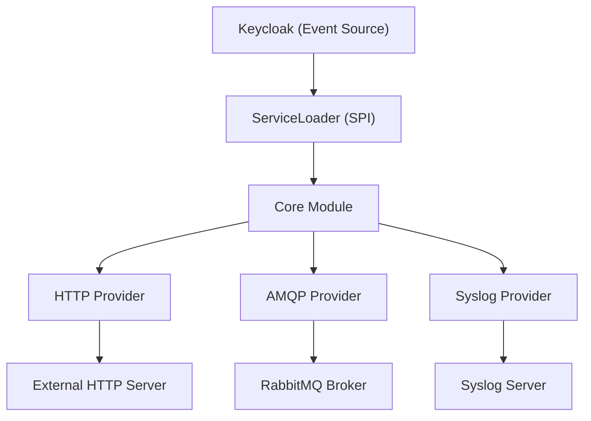

# Keycloak Webhook Plugin

A modular Keycloak event listener plugin that triggers webhooks whenever specific events (like login, registration, or
logout) occur in Keycloak. This project leverages a multi-module design so you can choose which transport provider (
HTTP,
AMQP, or Syslog) to deploy based on your needs.

| Keycloak Version | Plugin Version |
|------------------|----------------|
| 21               | ✅ 0.12.0-rc.1  |
| 22               | ✅ 0.12.0-rc.1  |
| 23               | ✅ 0.12.0-rc.1  |
| 24               | ✅ 0.12.0-rc.1  |
| 25               | ✅ 0.12.0-rc.1  |
| 26               | ✅ 0.12.0-rc.1  |

---

## 1. What It Is

The Keycloak Webhook Plugin consists of four modules:

- **Core Module (`keycloak-webhook-provider-core`)**  
  Contains common SPI interfaces, shared models, and helper utilities.

- **AMQP Provider (`keycloak-webhook-provider-amqp`)**  
  Implements webhook notifications over AMQP (e.g., RabbitMQ). If the AMQP dependency is present on the classpath, this
  provider is loaded automatically.

- **HTTP Provider (`keycloak-webhook-provider-http`)**  
  Implements webhook notifications over HTTP. This provider uses OpenAPI-generated clients to ensure compliance with the
  target API.

- **Syslog Provider (`keycloak-webhook-provider-syslog`)**  
  Implements webhook notifications over Syslog (TCP/UDP). Supports RFC 3164 and RFC 5424 message formats.

Keycloak uses Java's `ServiceLoader` mechanism to conditionally load these providers at runtime if their JARs (and
dependencies) are available.

---

## 2. How to Use It

1. [Download the plugins](#downloading-the-plugins). At least the core plugin and then the AMQP, HTTP or Syslog plugins according to your choice. The name of the plugins should be renamed to remove the version number and the `-all` suffix (for example `keycloak-webhook-provider-core.jar` instead of `keycloak-webhook-provider-core-${VERSION}-all.jar`).
2. Copy the plugins in KeyCloaks' `/opt/keycloak/providers` folder. See [Docker](#a-docker) and [Kubernetes](#b-kubernetes) configuration examples below.
3. Add the [environment variables](#3-environment-variables) to configure the webhook providers.
4. Add the `webhook-http` event listener in KeyCloak's interface in "Realms Settings" > "Events"


### Downloading the Plugins

Download the latest release artifacts (shaded JARs) from the GitHub releases page. For example, using `curl`:

```bash
# Replace <version> with the desired release version.

VERSION=<version>; curl -L -o keycloak-webhook-provider-core.jar https://github.com/vymalo/keycloak-webhook/releases/download/v${VERSION}/keycloak-webhook-provider-core-${VERSION}-all.jar; \
curl -L -o keycloak-webhook-provider-amqp.jar https://github.com/vymalo/keycloak-webhook/releases/download/v${VERSION}/keycloak-webhook-provider-amqp-${VERSION}-all.jar; \
curl -L -o keycloak-webhook-provider-http.jar https://github.com/vymalo/keycloak-webhook/releases/download/v${VERSION}/keycloak-webhook-provider-http-${VERSION}-all.jar; \
curl -L -o keycloak-webhook-provider-syslog.jar https://github.com/vymalo/keycloak-webhook/releases/download/v${VERSION}/keycloak-webhook-provider-syslog-${VERSION}-all.jar; \
```

### a. Docker

When running Keycloak in Docker, mount the downloaded JARs into Keycloak's providers directory. For example, in your
`docker-compose.yaml`:

```yaml
services:
  keycloak:
    image: quay.io/keycloak/keycloak:26.4.0
    ports:
      - "9100:9100"
    environment:
      # HTTP Provider Configuration
      WEBHOOK_HTTP_BASE_PATH: "http://prism:4010"
      WEBHOOK_HTTP_AUTH_USERNAME: "admin"
      WEBHOOK_HTTP_AUTH_PASSWORD: "password"
      # AMQP Provider Configuration
      WEBHOOK_AMQP_HOST: rabbitmq
      WEBHOOK_AMQP_USERNAME: username
      WEBHOOK_AMQP_PASSWORD: password
      WEBHOOK_AMQP_PORT: 5672
      WEBHOOK_AMQP_VHOST: "/"
      WEBHOOK_AMQP_EXCHANGE: keycloak
      WEBHOOK_AMQP_SSL: "no"
      # Syslog Provider Configuration
      WEBHOOK_SYSLOG_PROTOCOL: udp
      WEBHOOK_SYSLOG_HOSTNAME: keycloak
      WEBHOOK_SYSLOG_APP_NAME: Keycloak
      WEBHOOK_SYSLOG_FACILITY: USER
      WEBHOOK_SYSLOG_SEVERITY: INFORMATIONAL
      WEBHOOK_SYSLOG_SERVER_HOSTNAME: syslog-ng
      WEBHOOK_SYSLOG_SERVER_PORT: 5514
      WEBHOOK_SYSLOG_MESSAGE_FORMAT: RFC_5425
      # Keycloak Admin Credentials
      KEYCLOAK_ADMIN: admin
      KEYCLOAK_ADMIN_PASSWORD: password
      KC_HTTP_PORT: 9100
      KC_METRICS_ENABLED: "true"
      KC_LOG_CONSOLE_COLOR: "true"
      KC_HEALTH_ENABLED: "true"
    entrypoint: /bin/sh
    command:
      - -c
      - |
        set -ex
        # Copy all plugin JARs from the mounted volume into Keycloak's providers folder
        cp /tmp/plugins/*.jar /opt/keycloak/providers
        /opt/keycloak/bin/kc.sh start-dev --import-realm
    volumes:
      - ./plugins:/tmp/plugins:ro # Place your downloaded JARs in this folder
      - ./.docker/keycloak-config/:/opt/keycloak/data/import/:ro
```

### b. Kubernetes

In Kubernetes, you can use an init container to download the plugin JARs from GitHub artifacts and copy them into
Keycloak's providers folder. For example:

```yaml
apiVersion: apps/v1
kind: Deployment
metadata:
  name: keycloak
spec:
  replicas: 1
  selector:
    matchLabels:
      app: keycloak
  template:
    metadata:
      labels:
        app: keycloak
    spec:
      volumes:
        - name: providers-volume
          emptyDir: { }
      initContainers:
        - name: download-plugins
          image: curlimages/curl:8.1.2
          command:
            - sh
            - -c
            - |
              mkdir -p /plugins
              # Download the plugins from GitHub releases (update the URLs accordingly)
              curl -L -o /plugins/keycloak-webhook-provider-core.jar https://github.com/vymalo/keycloak-webhook/releases/download/v<version>/keycloak-webhook-provider-core-<version>-all.jar
              curl -L -o /plugins/keycloak-webhook-provider-amqp.jar https://github.com/vymalo/keycloak-webhook/releases/download/v<version>/keycloak-webhook-provider-amqp-<version>-all.jar
              curl -L -o /plugins/keycloak-webhook-provider-http.jar https://github.com/vymalo/keycloak-webhook/releases/download/v<version>/keycloak-webhook-provider-http-<version>-all.jar
              curl -L -o /plugins/keycloak-webhook-provider-syslog.jar https://github.com/vymalo/keycloak-webhook/releases/download/v<version>/keycloak-webhook-provider-syslog-<version>-all.jar
              cp /plugins/*.jar /providers/
          volumeMounts:
            - name: providers-volume
              mountPath: /providers
      containers:
        - name: keycloak
          image: quay.io/keycloak/keycloak:26.4.0
          env:
            - name: WEBHOOK_HTTP_BASE_PATH
              value: "http://prism:4010"
            - name: WEBHOOK_HTTP_AUTH_USERNAME
              value: "admin"
            - name: WEBHOOK_HTTP_AUTH_PASSWORD
              value: "password"
            - name: WEBHOOK_AMQP_HOST
              value: "rabbitmq"
            - name: WEBHOOK_AMQP_USERNAME
              value: "username"
            - name: WEBHOOK_AMQP_PASSWORD
              value: "password"
            - name: WEBHOOK_AMQP_PORT
              value: "5672"
            - name: WEBHOOK_AMQP_VHOST
              value: "/"
            - name: WEBHOOK_AMQP_EXCHANGE
              value: "keycloak"
            - name: WEBHOOK_AMQP_SSL
              value: "no"
            - name: WEBHOOK_SYSLOG_PROTOCOL
              value: "udp"
            - name: WEBHOOK_SYSLOG_SERVER_HOSTNAME
              value: "syslog-ng"
            - name: WEBHOOK_SYSLOG_SERVER_PORT
              value: "5514"
          volumeMounts:
            - name: providers-volume
              mountPath: /opt/keycloak/providers
```

---

## 3. Environment Variables

Settings are read from environment variables, with JVM system properties (`-DWEBHOOK_...=...`) as a fallback. They
are read once, when the listener handles its first event. If something is missing or malformed, that first event fails
with a single error that lists every problem key, and the next event tries again.

### All Providers

- **`WEBHOOK_EVENTS_TAKEN` (optional)**  
  A comma-separated list of event types that should trigger webhooks, e.g. `"LOGIN,REGISTER,LOGOUT"`. Admin events use
  `<RESOURCE>-<OPERATION>`, e.g. `USER-CREATE`. If not set, all events are sent. Note that an *empty* value is not the
  same as unset: it lets no events through.

### HTTP Provider

- **`WEBHOOK_HTTP_BASE_PATH`**  
  Coma-separated list of endpoint URLs where webhook requests are sent.

- **`WEBHOOK_HTTP_AUTH_USERNAME` (optional)**  
  Basic auth username.

- **`WEBHOOK_HTTP_AUTH_PASSWORD` (optional)**  
  Basic auth password.

### AMQP Provider

- **`WEBHOOK_AMQP_HOST`**  
  RabbitMQ server hostname. Not needed when `WEBHOOK_AMQP_ADDRESSES` is set.

- **`WEBHOOK_AMQP_USERNAME`**  
  Username for RabbitMQ.

- **`WEBHOOK_AMQP_PASSWORD`**  
  Password for RabbitMQ.

- **`WEBHOOK_AMQP_PORT`**  
  Port for RabbitMQ. Not needed when `WEBHOOK_AMQP_ADDRESSES` is set.

- **`WEBHOOK_AMQP_VHOST` (optional)**  
  Virtual host for RabbitMQ. Defaults to `/`.

- **`WEBHOOK_AMQP_EXCHANGE`**  
  Exchange name for RabbitMQ. The exchange must already exist; the plugin does not declare it.

- **`WEBHOOK_AMQP_SSL` (optional)**  
  `"true"` enables TLS; any other value (including `"yes"`) leaves it off. Without
  `WEBHOOK_AMQP_SSL_TRUSTSTORE`, TLS accepts any server certificate, and the plugin logs a warning saying so.

- **`WEBHOOK_AMQP_ENABLE_PUBLISHER_CONFIRM` (optional)**  
  `"true"` makes every publish wait until the broker confirms the message, so a lost message is logged as an error
  instead of disappearing silently. Costs one broker round trip per event.

- **`WEBHOOK_AMQP_PUBLISHER_CONFIRM_TIMEOUT` (optional)**  
  How long to wait for a confirm, in milliseconds. Defaults to `5000`.

The following settings are all optional. Leaving them unset keeps the behaviour described above.

- **`WEBHOOK_AMQP_ADDRESSES`**  
  Comma-separated `host` or `host:port` list for a RabbitMQ cluster, e.g. `rabbit-1:5672,rabbit-2:5672`. Replaces
  `WEBHOOK_AMQP_HOST` and `WEBHOOK_AMQP_PORT`. On every (re)connect the client tries the brokers in random order and
  skips the ones that are down. An entry without a port uses `5672`, or `5671` with TLS.

- **`WEBHOOK_AMQP_HEARTBEAT_SECONDS`**  
  AMQP heartbeat interval. Defaults to the client's `60`. Lower it if a load balancer or firewall drops idle
  connections sooner.

- **`WEBHOOK_AMQP_SSL_TRUSTSTORE`**, **`WEBHOOK_AMQP_SSL_TRUSTSTORE_PASSWORD`**, **`WEBHOOK_AMQP_SSL_TRUSTSTORE_TYPE`**  
  Path, password and type (default `PKCS12`) of a truststore holding the CA that signed the broker's certificate.
  When set, the broker's certificate and host name are verified. Requires `WEBHOOK_AMQP_SSL="true"`. If a file can't
  be loaded, the listener fails to start with an error naming it. If TLS traffic passes through something that
  re-signs it (a corporate proxy, or antivirus "HTTPS scanning"), the truststore needs *that* CA instead.

- **`WEBHOOK_AMQP_PERSISTENT`**  
  `"true"` publishes messages as persistent, so durable queues keep them across broker restarts.

- **`WEBHOOK_AMQP_MESSAGE_ID`**  
  `"true"` gives every message a random UUID `message-id`, so consumers can recognise redeliveries.

- **`WEBHOOK_AMQP_DECLARE_EXCHANGE`**  
  `"true"` declares `WEBHOOK_AMQP_EXCHANGE` as a durable topic exchange on connect, so it no longer has to exist
  beforehand. If an exchange with that name already exists with other settings, it is used as it is and a warning is
  logged.

- **`WEBHOOK_AMQP_MANDATORY`**  
  `"true"` publishes with the mandatory flag. RabbitMQ drops a message that no queue is bound to receive, and
  confirms it anyway, so publisher confirms alone can't tell "delivered" from "went nowhere". With this option the
  broker hands such messages back, and the plugin logs each one as an error (exchange, routing key, reason). They are
  not retried: routing only changes when someone binds a queue. To keep them, give the exchange an
  [alternate exchange](https://www.rabbitmq.com/docs/ae) on the broker.

- **`WEBHOOK_AMQP_PUBLISH_MODE`**  
  `sync` (the default) publishes on the Keycloak request thread. `async` hands events to a background publisher, so a
  login never waits for RabbitMQ. See [Delivery and Lifecycle](#delivery-and-lifecycle).

- **`WEBHOOK_AMQP_BUFFER_CAPACITY`**  
  Async only: how many events are kept in memory while the broker is slow or unreachable. Defaults to `1000`. When
  it's full, the oldest event is dropped to make room.

- **`WEBHOOK_AMQP_INFLIGHT_CAPACITY`**  
  Async with publisher confirms only: how many messages may wait for their confirm at once. Defaults to `1000`.

Messages are published with the routing key `KC_CLIENT.<realmId>.<clientId>.<userId>.<type>` (missing ids become
`xxx`), so consumers can bind on any part, e.g. `KC_CLIENT.*.*.*.LOGIN`.

### Syslog Provider

- **`WEBHOOK_SYSLOG_PROTOCOL`**  
  `"TCP"` or `"UDP"` protocol for Syslog communication.

- **`WEBHOOK_SYSLOG_HOSTNAME`**  
  Hostname of the Keycloak instance, sent in every message's HOSTNAME field so the Syslog server can tell senders
  apart.

- **`WEBHOOK_SYSLOG_APP_NAME`**  
  Application name for Syslog messages.

- **`WEBHOOK_SYSLOG_FACILITY` (optional)**  
  Syslog facility (e.g., USER, DAEMON, AUTH). Defaults to `SYSLOG`.

- **`WEBHOOK_SYSLOG_SEVERITY` (optional)**  
  Syslog severity level (e.g., INFORMATIONAL, WARNING, ERROR). Defaults to `INFORMATIONAL`.

- **`WEBHOOK_SYSLOG_SERVER_HOSTNAME`**  
  Hostname of the Syslog server.

- **`WEBHOOK_SYSLOG_SERVER_PORT`**  
  Port of the Syslog server.

- **`WEBHOOK_SYSLOG_MESSAGE_FORMAT` (optional)**  
  `"RFC_3164"`, `"RFC_5424"` or `"RFC_5425"` message format. Defaults to `RFC_5425`.

---

## 4. Architecture

The architecture of the Keycloak Webhook Plugin is illustrated using a Mermaid diagram below:



- **Core Module:**  
  Provides common interfaces, models, and utilities.

- **Provider Modules:**  
  Implement specific webhook delivery mechanisms (HTTP, AMQP, or Syslog) and are conditionally loaded if their JARs are
  present.

- **ServiceLoader:**  
  Uses Java's SPI to discover and load the providers.

- **External Systems:**  
  Webhook notifications are sent to an HTTP server, published to a RabbitMQ broker, or forwarded to a Syslog server.

### Delivery and Lifecycle

Each provider has one *transport* (its broker connection, HTTP client or Syslog sender). The transport is opened when
the listener handles its first event and stays open until Keycloak shuts down; Keycloak sessions come and go without
reconnecting. Sending happens on the Keycloak request thread, and a delivery problem is logged, never passed back to
Keycloak, so it cannot fail a login or an admin action:

- **AMQP:** if the connection is down, the plugin reconnects inline (3 attempts, 1 second apart). If all three fail,
  the event is logged and dropped.
- **AMQP with `WEBHOOK_AMQP_PUBLISH_MODE=async`:** the request thread only adds the event to an in-memory buffer; one
  background thread sends it and reconnects (with backoff) when needed.
  - With `WEBHOOK_AMQP_ENABLE_PUBLISHER_CONFIRM="true"`, delivery is *at least once*. A message that isn't confirmed
    within `WEBHOOK_AMQP_PUBLISHER_CONFIRM_TIMEOUT` is sent again on a new connection. Consumers may therefore see
    duplicates; `WEBHOOK_AMQP_MESSAGE_ID="true"` gives each event one id that stays the same across resends, so they
    can drop them.
  - Without confirms, a message counts as sent once it's written to the connection, as in sync mode.
  - A message the broker refuses (a nack, or the channel closed over it, e.g. because the exchange doesn't exist) is
    tried 5 times, then dropped with an error in the log.
  - Events only live in memory: if the buffer is full the oldest are dropped, and a crash loses what's buffered.
  - On shutdown the publisher gets up to 5 seconds to send what's left, plus up to 5 more if the broker stops
    answering. It then logs how much was lost, along with totals for reconnects, resends and drops.
- **HTTP:** every URL is tried up to 3 times, 1 second apart, one URL after another, on the request thread. A slow
  or failing URL therefore slows every login. Measured with the integration tests (Keycloak 26.2.3, 25 requests a
  second): while one of two URLs answered 500, each request took about 2 s longer; while one hung without answering,
  each request took 32 s (three 10 s client timeouts plus the pauses), and Keycloak served 7 requests in 30 s instead
  of about 750.
- **Syslog:** the sender sends on the request thread.
  - UDP is fire-and-forget. While the server hung for 30 s, logins stayed fast but those events were lost. While it
    was down, so its host name no longer resolved, the sender kept looking the name up again: requests took up to
    8 s, and those events were lost too.
  - TCP reconnects on its own. A server that hung for 30 s held requests for up to 17 s; they were delivered
    afterwards. A server that was down cost up to 15 s per request, and those events were lost.

#### Choosing a publish mode

Measured with the integration tests on Keycloak 26.2.3 and RabbitMQ 3.13, under steady traffic of 25 requests a
second (logins, refreshes, userinfo, introspection, logouts, service accounts). "async" means
`WEBHOOK_AMQP_PUBLISH_MODE=async`; "confirms" means `WEBHOOK_AMQP_ENABLE_PUBLISHER_CONFIRM="true"`.

One broker that hangs for 2 minutes:

| Setup | Requests served during the hang (of ~3,000) | Latency during the hang | Events delivered |
|-------|---------------------------------------------|-------------------------|------------------|
| sync (the default) | 311 | p99 108 s: requests wait until the broker is back | 799 of 1,091: 292 lost without a trace |
| sync + confirms | 33 | p50 30 s, up to 70 s: requests queue in 5 s steps | all |
| async | 3,002 | p99 23 ms | all, this time |
| async + confirms | 3,002 | p99 24 ms | all, plus 2 duplicates (resent, same message id) |

A three-node cluster with quorum queues (see `ClusterScenarios` in the integration tests):

| Setup | Healthy, 50,000 events | Node crash | Rolling restart | Majority lost for 60 s | Events lost |
|-------|------------------------|------------|-----------------|------------------------|-------------|
| sync | 213/s, p99 214 ms | p99 43 ms | p99 31 ms | p99 67 s | 1, in the crash |
| sync + confirms | **58/s, p99 1.3 s** | up to 7 s | up to 0.6 s | p99 69 s | 1, in the crash |
| async | 219/s, p99 221 ms | p99 35 ms | p99 36 ms | p99 34 ms | 1, in the crash |
| async + confirms | 217/s, p99 226 ms | p99 29 ms | p99 30 ms | p99 28 ms | none |

What that means:

- In sync mode a RabbitMQ outage becomes a Keycloak outage, because every request waits for the broker; without
  confirms, events can also vanish silently.
- Sync with confirms on quorum queues is slow even when everything is healthy: every request waits until a majority
  of nodes has stored its message, one request at a time.
- Only async with confirms kept Keycloak fast through every disruption and lost nothing. A message that was on its way
  to a crashing node is sent again, so consumers can see a duplicate; `WEBHOOK_AMQP_MESSAGE_ID="true"` gives each
  event one id across resends so they can drop it.

For production that means `WEBHOOK_AMQP_PUBLISH_MODE=async`, `WEBHOOK_AMQP_ENABLE_PUBLISHER_CONFIRM="true"` and
`WEBHOOK_AMQP_MESSAGE_ID="true"`. Size `WEBHOOK_AMQP_BUFFER_CAPACITY` as your peak events per second times the longest
outage you want to ride out; beyond that the oldest events are dropped. A buffered event takes about 1 KB of heap
(1.3 KB with message ids; measured with realistic login and admin events), so a full 100,000-event buffer holds about
100–130 MB. The memory is only used while the buffer is actually filling up during an outage.

The core module turns Keycloak events into a `WebhookPayload` with pure functions. Each provider module only
implements `Transport` (`publish` and `close`) and parses its own settings.

---

## 5. Contribute

We welcome contributions! To get started:

1. **Fork the Repository:**  
   Create your own fork of the project on GitHub.

2. **Set Up Your Development Environment:**

- Clone your fork locally.
- Ensure you have JDK 17 and Gradle installed.
- Build the project using:
  ```bash
  ./gradlew clean shadow
  ```
- Run the tests with `./gradlew test`. The AMQP broker tests start RabbitMQ through
  [Testcontainers](https://testcontainers.com). Docker is optional locally: without it those tests are skipped
  (listed as `SKIPPED`), and everything else still runs. With Docker you can still skip them for a quicker run by
  setting `SKIP_DOCKER_TESTS=true`. CI never skips them. If your antivirus scans HTTPS traffic (AVG, Avast and
  others do by default), it also re-signs the tests' local TLS connections: the TLS test that verifies the broker's
  certificate then skips itself and names the interceptor.
- Integration tests run the built plugin jars inside real Keycloak containers against RabbitMQ. They are not part of
  `build` or CI; start them on demand (Docker required, expect several minutes):
  ```bash
  ./gradlew integrationTest                                    # everything below
  ./gradlew integrationTest --tests '*DefaultsSmokeTest*'      # all three providers, default settings, every supported Keycloak version
  ./gradlew integrationTest --tests '*SyncWithConfirmsTest*'   # production scenarios, sync publishing with confirms
  ./gradlew integrationTest --tests '*AsyncAtLeastOnceTest*'   # the same scenarios, async publishing
  ./gradlew integrationTest --tests '*ClusterTest'             # every setup against a three-node quorum cluster
  ./gradlew integrationTest --tests '*HttpTest'                # HTTP: Prism validating against the OpenAPI spec, plus a recorder
  ./gradlew integrationTest --tests '*Syslog*Test'             # Syslog over UDP and TCP, against syslog-ng
  ```
  The production scenarios cover real logins, failed logins and admin events, one broker connection for all
  sessions, logins while the broker hangs, an organic load (login, refresh, userinfo, introspection, logout, service
  accounts) of `-Pevents=50000` events checked for completeness per event type, a long outage, and a graceful Keycloak
  shutdown. Each runs for four publish setups, on one broker and on a three-node quorum cluster (`*ClusterTest`),
  which also gets a node crash, a rolling restart and the loss of its majority. All of it takes about 1.5 hours.
  `keycloak-webhook-integration-tests/run-sequentially.sh` runs every class in its own Gradle run, one after
  another, which keeps memory use low and keeps finished results if the run is stopped; it passes extra arguments
  (such as `-Pevents=2000`) to every run and writes a summary, logs and reports to `build/integration-test-runs/`.
  `-PkeycloakVersion=26.2.3` picks the version for those scenarios, `-PkeycloakVersions=21.1.2,26.2.3` the smoke
  matrix, and `-Pconcurrency=32` the number of parallel clients.

3. **Follow Code Conventions:**

- Keep the code style consistent with the existing modules.
- Write tests where applicable. The provider tests pin exactly what goes on the wire (see `Fixtures` in the core
  module's test fixtures); a change that alters that output should be deliberate, opt-in, and documented.
- Update the README and documentation if your changes require it.

4. **Submit a Pull Request:**  
   Open a pull request with your proposed changes. Please include a detailed description and reference any related
   issues.

5. **Join Discussions:**  
   Use GitHub issues to discuss ideas, report bugs, or ask for help.

---

This modular and flexible design allows you to deploy only the providers you need while keeping the project maintainable
and extensible. Happy coding!
