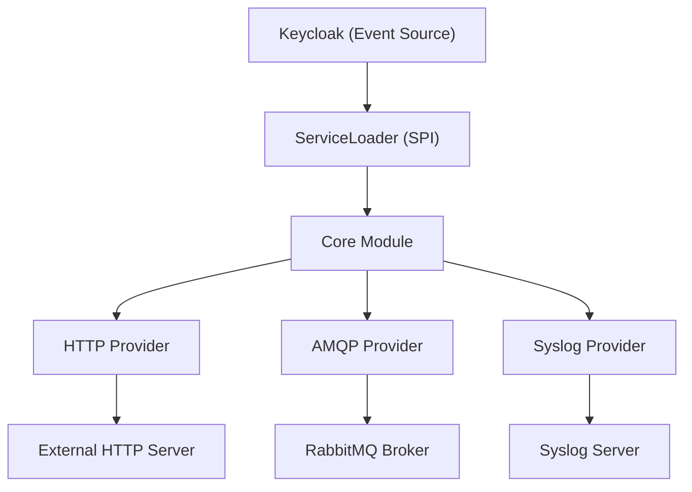

# Keycloak Webhook Plugin

A modular Keycloak event listener plugin that triggers webhooks whenever specific events (like login, registration, or
logout) occur in Keycloak. This project leverages a multi-module design so you can choose which transport provider (
HTTP,
AMQP, or Syslog) to deploy based on your needs.

| Keycloak Version | Plugin Version |
|------------------|----------------|
| 21               | ✅ 0.10.0-rc.1  |
| 22               | ✅ 0.10.0-rc.1  |
| 23               | ✅ 0.10.0-rc.1  |
| 24               | ✅ 0.10.0-rc.1  |
| 25               | ✅ 0.10.0-rc.1  |
| 26               | ✅ 0.10.0-rc.1  |

---

## 1. What It Is

The Keycloak Webhook Plugin consists of four modules:

- **Core Module (`keycloak-webhook-provider-core`)**  
  Contains common SPI interfaces, shared models, and helper utilities.

- **AMQP Provider (`keycloak-webhook-provider-amqp`)**  
  Implements webhook notifications over AMQP (e.g., RabbitMQ). If the AMQP dependency is present on the classpath, this
  provider is loaded automatically.

- **HTTP Provider (`keycloak-webhook-provider-http`)**  
  Implements webhook notifications over HTTP. This provider uses OpenAPI-generated clients to ensure compliance with the
  target API.

- **Syslog Provider (`keycloak-webhook-provider-syslog`)**  
  Implements webhook notifications over Syslog (TCP/UDP). Supports RFC 3164 and RFC 5424 message formats.

Keycloak uses Java's `ServiceLoader` mechanism to conditionally load these providers at runtime if their JARs (and
dependencies) are available.

---

## 2. How to Use It

1. [Download the plugins](#downloading-the-plugins). At least the core plugin and then the AMQP, HTTP or Syslog plugins according to your choice. The name of the plugins should be renamed to remove the version number and the `-all` suffix (for example `keycloak-webhook-provider-core.jar` instead of `keycloak-webhook-provider-core-${VERSION}-all.jar`).
2. Copy the plugins in KeyCloaks' `/opt/keycloak/providers` folder. See [Docker](#a-docker) and [Kubernetes](#b-kubernetes) configuration examples below.
3. Add the [environment variables](#3-environment-variables) to configure the webhook providers.
4. Add the `webhook-http` event listener in KeyCloak's interface in "Realms Settings" > "Events"


### Downloading the Plugins

Download the latest release artifacts (shaded JARs) from the GitHub releases page. For example, using `curl`:

```bash
# Replace <version> with the desired release version.

VERSION=<version>; curl -L -o keycloak-webhook-provider-core.jar https://github.com/vymalo/keycloak-webhook/releases/download/v${VERSION}/keycloak-webhook-provider-core-${VERSION}-all.jar; \
curl -L -o keycloak-webhook-provider-amqp.jar https://github.com/vymalo/keycloak-webhook/releases/download/v${VERSION}/keycloak-webhook-provider-amqp-${VERSION}-all.jar; \
curl -L -o keycloak-webhook-provider-http.jar https://github.com/vymalo/keycloak-webhook/releases/download/v${VERSION}/keycloak-webhook-provider-http-${VERSION}-all.jar; \
curl -L -o keycloak-webhook-provider-syslog.jar https://github.com/vymalo/keycloak-webhook/releases/download/v${VERSION}/keycloak-webhook-provider-syslog-${VERSION}-all.jar; \
```

### a. Docker

When running Keycloak in Docker, mount the downloaded JARs into Keycloak's providers directory. For example, in your
`docker-compose.yaml`:

```yaml
services:
  keycloak:
    image: quay.io/keycloak/keycloak:26.4.0
    ports:
      - "9100:9100"
    environment:
      # HTTP Provider Configuration
      WEBHOOK_HTTP_BASE_PATH: "http://prism:4010"
      WEBHOOK_HTTP_AUTH_USERNAME: "admin"
      WEBHOOK_HTTP_AUTH_PASSWORD: "password"
      # AMQP Provider Configuration
      WEBHOOK_AMQP_HOST: rabbitmq
      WEBHOOK_AMQP_USERNAME: username
      WEBHOOK_AMQP_PASSWORD: password
      WEBHOOK_AMQP_PORT: 5672
      WEBHOOK_AMQP_VHOST: "/"
      WEBHOOK_AMQP_EXCHANGE: keycloak
      WEBHOOK_AMQP_SSL: "no"
      # Syslog Provider Configuration
      WEBHOOK_SYSLOG_PROTOCOL: udp
      WEBHOOK_SYSLOG_HOSTNAME: keycloak
      WEBHOOK_SYSLOG_APP_NAME: Keycloak
      WEBHOOK_SYSLOG_FACILITY: USER
      WEBHOOK_SYSLOG_SEVERITY: INFORMATIONAL
      WEBHOOK_SYSLOG_SERVER_HOSTNAME: syslog-ng
      WEBHOOK_SYSLOG_SERVER_PORT: 5514
      WEBHOOK_SYSLOG_MESSAGE_FORMAT: RFC_5425
      # Keycloak Admin Credentials
      KEYCLOAK_ADMIN: admin
      KEYCLOAK_ADMIN_PASSWORD: password
      KC_HTTP_PORT: 9100
      KC_METRICS_ENABLED: "true"
      KC_LOG_CONSOLE_COLOR: "true"
      KC_HEALTH_ENABLED: "true"
    entrypoint: /bin/sh
    command:
      - -c
      - |
        set -ex
        # Copy all plugin JARs from the mounted volume into Keycloak's providers folder
        cp /tmp/plugins/*.jar /opt/keycloak/providers
        /opt/keycloak/bin/kc.sh start-dev --import-realm
    volumes:
      - ./plugins:/tmp/plugins:ro # Place your downloaded JARs in this folder
      - ./.docker/keycloak-config/:/opt/keycloak/data/import/:ro
```

### b. Kubernetes

In Kubernetes, you can use an init container to download the plugin JARs from GitHub artifacts and copy them into
Keycloak's providers folder. For example:

```yaml
apiVersion: apps/v1
kind: Deployment
metadata:
  name: keycloak
spec:
  replicas: 1
  selector:
    matchLabels:
      app: keycloak
  template:
    metadata:
      labels:
        app: keycloak
    spec:
      volumes:
        - name: providers-volume
          emptyDir: { }
      initContainers:
        - name: download-plugins
          image: curlimages/curl:8.1.2
          command:
            - sh
            - -c
            - |
              mkdir -p /plugins
              # Download the plugins from GitHub releases (update the URLs accordingly)
              curl -L -o /plugins/keycloak-webhook-provider-core.jar https://github.com/vymalo/keycloak-webhook/releases/download/v<version>/keycloak-webhook-provider-core-<version>-all.jar
              curl -L -o /plugins/keycloak-webhook-provider-amqp.jar https://github.com/vymalo/keycloak-webhook/releases/download/v<version>/keycloak-webhook-provider-amqp-<version>-all.jar
              curl -L -o /plugins/keycloak-webhook-provider-http.jar https://github.com/vymalo/keycloak-webhook/releases/download/v<version>/keycloak-webhook-provider-http-<version>-all.jar
              curl -L -o /plugins/keycloak-webhook-provider-syslog.jar https://github.com/vymalo/keycloak-webhook/releases/download/v<version>/keycloak-webhook-provider-syslog-<version>-all.jar
              cp /plugins/*.jar /providers/
          volumeMounts:
            - name: providers-volume
              mountPath: /providers
      containers:
        - name: keycloak
          image: quay.io/keycloak/keycloak:26.4.0
          env:
            - name: WEBHOOK_HTTP_BASE_PATH
              value: "http://prism:4010"
            - name: WEBHOOK_HTTP_AUTH_USERNAME
              value: "admin"
            - name: WEBHOOK_HTTP_AUTH_PASSWORD
              value: "password"
            - name: WEBHOOK_AMQP_HOST
              value: "rabbitmq"
            - name: WEBHOOK_AMQP_USERNAME
              value: "username"
            - name: WEBHOOK_AMQP_PASSWORD
              value: "password"
            - name: WEBHOOK_AMQP_PORT
              value: "5672"
            - name: WEBHOOK_AMQP_VHOST
              value: "/"
            - name: WEBHOOK_AMQP_EXCHANGE
              value: "keycloak"
            - name: WEBHOOK_AMQP_SSL
              value: "no"
            - name: WEBHOOK_SYSLOG_PROTOCOL
              value: "udp"
            - name: WEBHOOK_SYSLOG_SERVER_HOSTNAME
              value: "syslog-ng"
            - name: WEBHOOK_SYSLOG_SERVER_PORT
              value: "5514"
          volumeMounts:
            - name: providers-volume
              mountPath: /opt/keycloak/providers
```

---

## 3. Environment Variables

Settings are read from environment variables, with JVM system properties (`-DWEBHOOK_...=...`) as a fallback. They
are read once, when the listener handles its first event. If something is missing or malformed, that first event fails
with a single error that lists every problem key, and the next event tries again.

### All Providers

- **`WEBHOOK_EVENTS_TAKEN` (optional)**  
  A comma-separated list of event types that should trigger webhooks, e.g. `"LOGIN,REGISTER,LOGOUT"`. Admin events use
  `<RESOURCE>-<OPERATION>`, e.g. `USER-CREATE`. If not set, all events are sent. Note that an *empty* value is not the
  same as unset: it lets no events through.

### HTTP Provider

- **`WEBHOOK_HTTP_BASE_PATH`**  
  Coma-separated list of endpoint URLs where webhook requests are sent.

- **`WEBHOOK_HTTP_AUTH_USERNAME` (optional)**  
  Basic auth username.

- **`WEBHOOK_HTTP_AUTH_PASSWORD` (optional)**  
  Basic auth password.

### AMQP Provider

- **`WEBHOOK_AMQP_HOST`**  
  RabbitMQ server hostname.

- **`WEBHOOK_AMQP_USERNAME`**  
  Username for RabbitMQ.

- **`WEBHOOK_AMQP_PASSWORD`**  
  Password for RabbitMQ.

- **`WEBHOOK_AMQP_PORT`**  
  Port for RabbitMQ.

- **`WEBHOOK_AMQP_VHOST` (optional)**  
  Virtual host for RabbitMQ. Defaults to `/`.

- **`WEBHOOK_AMQP_EXCHANGE`**  
  Exchange name for RabbitMQ. The exchange must already exist; the plugin does not declare it.

- **`WEBHOOK_AMQP_SSL` (optional)**  
  `"true"` enables TLS; any other value (including `"yes"`) leaves it off. Note that TLS currently accepts any server
  certificate.

- **`WEBHOOK_AMQP_ENABLE_PUBLISHER_CONFIRM` (optional)**  
  `"true"` makes every publish wait until the broker confirms the message, so a lost message is logged as an error
  instead of disappearing silently. Costs one broker round trip per event.

- **`WEBHOOK_AMQP_PUBLISHER_CONFIRM_TIMEOUT` (optional)**  
  How long to wait for a confirm, in milliseconds. Defaults to `5000`.

Messages are published with the routing key `KC_CLIENT.<realmId>.<clientId>.<userId>.<type>` (missing ids become
`xxx`), so consumers can bind on any part, e.g. `KC_CLIENT.*.*.*.LOGIN`.

### Syslog Provider

- **`WEBHOOK_SYSLOG_PROTOCOL`**  
  `"TCP"` or `"UDP"` protocol for Syslog communication.

- **`WEBHOOK_SYSLOG_HOSTNAME`**  
  Hostname of the Keycloak instance. Required, but currently not used: messages carry the Syslog server hostname in
  their HOSTNAME field instead.

- **`WEBHOOK_SYSLOG_APP_NAME`**  
  Application name for Syslog messages.

- **`WEBHOOK_SYSLOG_FACILITY` (optional)**  
  Syslog facility (e.g., USER, DAEMON, AUTH). Defaults to `SYSLOG`.

- **`WEBHOOK_SYSLOG_SEVERITY` (optional)**  
  Syslog severity level (e.g., INFORMATIONAL, WARNING, ERROR). Defaults to `INFORMATIONAL`.

- **`WEBHOOK_SYSLOG_SERVER_HOSTNAME`**  
  Hostname of the Syslog server.

- **`WEBHOOK_SYSLOG_SERVER_PORT`**  
  Port of the Syslog server.

- **`WEBHOOK_SYSLOG_MESSAGE_FORMAT` (optional)**  
  `"RFC_3164"`, `"RFC_5424"` or `"RFC_5425"` message format. Defaults to `RFC_5425`.

---

## 4. Architecture

The architecture of the Keycloak Webhook Plugin is illustrated using a Mermaid diagram below:



- **Core Module:**  
  Provides common interfaces, models, and utilities.

- **Provider Modules:**  
  Implement specific webhook delivery mechanisms (HTTP, AMQP, or Syslog) and are conditionally loaded if their JARs are
  present.

- **ServiceLoader:**  
  Uses Java's SPI to discover and load the providers.

- **External Systems:**  
  Webhook notifications are sent to an HTTP server, published to a RabbitMQ broker, or forwarded to a Syslog server.

### Delivery and Lifecycle

Each provider has one *transport* (its broker connection, HTTP client or Syslog sender). The transport is opened when
the listener handles its first event and stays open until Keycloak shuts down; Keycloak sessions come and go without
reconnecting. Sending happens on the Keycloak request thread, and a delivery problem is logged, never passed back to
Keycloak, so it cannot fail a login or an admin action:

- **AMQP:** if the connection is down, the plugin reconnects inline (3 attempts, 1 second apart). If all three fail,
  the event is logged and dropped.
- **HTTP:** every URL is tried up to 3 times, 1 second apart, one URL after another.
- **Syslog:** UDP is fire-and-forget; the TCP sender reconnects on its own.

The core module turns Keycloak events into a `WebhookPayload` with pure functions. Each provider module only
implements `Transport` (`publish` and `close`) and parses its own settings.

---

## 5. Contribute

We welcome contributions! To get started:

1. **Fork the Repository:**  
   Create your own fork of the project on GitHub.

2. **Set Up Your Development Environment:**

- Clone your fork locally.
- Ensure you have JDK 17 and Gradle installed.
- Build the project using:
  ```bash
  ./gradlew clean shadow
  ```
- Run the tests with `./gradlew test`. The AMQP broker tests start RabbitMQ through
  [Testcontainers](https://testcontainers.com). Docker is optional locally: without it those tests are skipped
  (listed as `SKIPPED`), and everything else still runs. With Docker you can still skip them for a quicker run by
  setting `SKIP_DOCKER_TESTS=true`. CI never skips them.

3. **Follow Code Conventions:**

- Keep the code style consistent with the existing modules.
- Write tests where applicable. The provider tests pin exactly what goes on the wire (see `Fixtures` in the core
  module's test fixtures); a change that alters that output should be deliberate, opt-in, and documented.
- Update the README and documentation if your changes require it.

4. **Submit a Pull Request:**  
   Open a pull request with your proposed changes. Please include a detailed description and reference any related
   issues.

5. **Join Discussions:**  
   Use GitHub issues to discuss ideas, report bugs, or ask for help.

---

This modular and flexible design allows you to deploy only the providers you need while keeping the project maintainable
and extensible. Happy coding!
